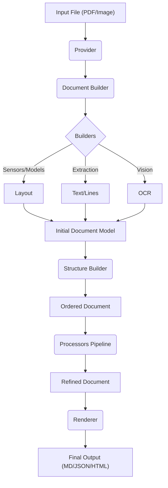

# Marker Architecture Deep Dive

Marker is a high-performance pipeline for converting documents (PDFs, Images) into structured data (Markdown, JSON, HTML). This document analyzes each component in the pipeline, detailing **exactly what it does**, **how it transforms data**, and the **order of execution**.

## High-Level Data Flow

The conversion process follows a linear pipeline:



## 1. Converters (`marker/converters`)

**Role**: Orchestrator.
The Converter is the entry point. It doesn't do the heavy lifting itself; instead, it initializes and chains together the other components (Providers, Builders, Processors, Renderers).

**Key Action**: `PdfConverter.__call__`
*   Initializes the `Project` configuration.
*   Instantiates the correct **Provider** based on file type.
*   Runs the **DocumentBuilder** to creating the initial `Document`.
*   Runs the **Processor Pipeline** (list of ~30 processors) to refine the data.
*   Runs the **Renderer** to serialize the output.

---

## 2. Providers (`marker/providers`)

**Role**: Data Abstraction Layer.
Providers normalize the input file into a standard interface that the rest of Marker can consume. They hide the complexity of different file formats (PDF vs Image).

**Data Transformation**:
*   **Input**: `filepath` (e.g., `doc.pdf`)
*   **Output**:
    *   `get_images(dpi)`: Returns a list of `PIL.Image` objects (rasterized pages).
    *   `extract_text()`: Returns raw text strings with bounding boxes (if digital text exists).
    *   `get_page_count()`: Integer.

**Example**:
The `PdfProvider` uses libraries like `pypdfium2` to render images for the Vision models and `pdftext` to extract raw text characters.

---

## 3. Builders (`marker/builders`)

**Role**: Construction.
Builders are responsible for populating the empty `Document` object. This is where the heavy ML models run.

**Execution Order**: **SEQUENTIAL**
Contrary to some assumptions, these steps happen one after another, not in parallel. This is because subsequent steps depend on the data from previous steps.

### Step 3.1: Document Builder (`DocumentBuilder`)
*   **Action**: Creates the root `Document` object and `Page` objects.
*   **Data**: Sets up the skeleton. No blocks yet.

### Step 3.2: Layout Builder (`LayoutBuilder`)
*   **Action**: Runs the **Surya Layout Detection** model (Vision).
*   **Input**: Page Images (Low-Res).
*   **Output**: A list of Layout Blocks per page.
    *   *Example*: `Block(type=Table, bbox=[10, 10, 50, 50])`, `Block(type=Text, bbox=[...])`.
*   **Transformation**: Pixels -> Unordered Semantic Regions (Bounding Boxes).

### Step 3.3: Line Builder (`LineBuilder`)
*   **Action**: Extracts text lines and assigns them to the Layout Blocks.
*   **Input**: Raw PDF text (via `pdftext`) + Layout Blocks.
*   **Process**:
    1.  Extracts all text lines from the PDF.
    2.  Calculates intersection between text lines and Layout Blocks.
    3.  **Assignment**: If a line is inside a `Table` block, it becomes a child of that Table.
    4.  **Heuristics**: If lines exist where *no* layout block was found, new Text blocks are created to ensure no text is lost.
*   **Transformation**: Raw Text Lines -> Hierarchical Text Blocks.

### Step 3.4: OCR Builder (`OcrBuilder`)
*   **Action**: Conditional text recovery.
*   **Trigger**: Runs if `force_ocr` is True OR if the extracted text quality is bad (high garbled character rate).
*   **Tool**: **Surya OCR** model.
*   **Process**: Overwrites the `text` field of blocks with text recognized closely from the image.
*   **Transformation**: Image Pixels -> Text String (replaces broken text).

### Step 3.5: Structure Builder (`StructureBuilder`)
*   **Action**: Sorting.
*   **Problem**: Layout detection returns blocks in random order (or detection certainty order).
*   **Solution**: Sorts blocks logicially based on reading order (e.g., column detection, top-down).
*   **Output**: Populates `Page.structure`, an ordered list of `BlockId`s.

---

## 4. Schema (`marker/schema`)

**Role**: Data Structure Definition.
This defines the "World" the processors live in.

**Hierarchy**:
```text
Document
├── metadata (dict)
└── pages (List[PageGroup])
    ├── children (all blocks, unordered map)
    ├── structure (ordered list of IDs)
    └── Blocks (Text, Table, Image, etc.)
        ├── id (e.g., /page/0/Table/5)
        ├── polygon (bounding box)
        ├── html (content)
        ├── structure (if it has children, e.g., Table rows)
        └── children (recursive blocks)
```
**Data Flow**: The `Document` object is mutable. Builders create it, and Processors modify it in place.

---

## 5. Processors (`marker/processors`)

**Role**: Refinement & Enrichment.
A linear pipeline of ~30 functions that polish the document.

**Execution Order**: Sequential list.
1.  **Cleanup**: `IgnoreTextProcessor` removes headers/footers based on geometric heuristics.
2.  **Merging**: `LineMergeProcessor` takes single lines (from LineBuilder) and merges them into paragraphs based on spacing and font.
3.  **Formatting**: `TableProcessor` traverses `Table` blocks and formats their internal structure into standardized HTML/Markdown.
4.  **Enrichment (LLM)**:
    *   `LLMSummaryProcessor`: Sends block text to Gemini/GPT. Adds a `summary` field to the block metadata.
    *   `LLMTableProcessor`: Sends table image to LLM to fix OCR errors. Replaces the `html` content.

**Transformation Example (LineMerge)**:
*   *Before*: 3 separate `Line` blocks.
*   *After*: 1 `Text` block containing the joined string. The original `Line` blocks are marked `removed=True`.

---

## 6. Renderers (`marker/renderers`)

**Role**: Serialization.
Converts the internal `Document` graph into a string or file.

**Markdown Renderer**:
*   Iterates `Page.structure`.
*   Fetches the block.
*   Converts block type to Markdown (e.g., `SectionHeader` -> `## Title`).
*   Writes to file.

**JSON Renderer**:
*   Dumps the entire object graph `document.model_dump()`.
*   Includes exact bounding boxes for every element (useful for RAG/highlighting).

---

## Summary of Data Flow

| Phase | Input | Operation | Output |
| :--- | :--- | :--- | :--- |
| **Ingestion** | `file.pdf` | `Provider` | Images + Raw Text |
| **Construction** | Images | `LayoutBuilder` (Vision) | Layout BBoxes |
| **Construction** | Raw Text | `LineBuilder` (Math) | Text assigned to BBoxes |
| **Construction** | Images | `OcrBuilder` (Vision) | Corrected Text |
| **Processing** | Document | `LineMerge` | Paragraphs |
| **Processing** | Document | `LLM` | Summaries/Fixes |
| **Rendering** | Document | `MarkdownRenderer` | `output.md` |

