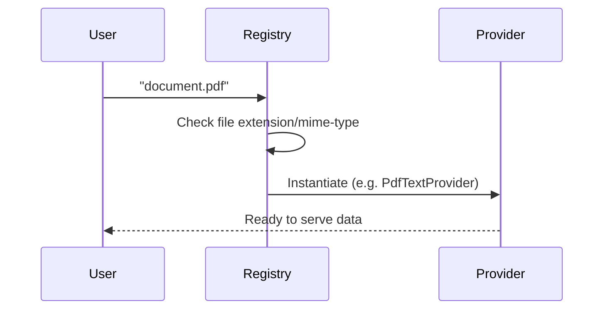

# Ingestion Phase: Providers

The **Ingestion** phase is responsible for accepting a user's input (a file path or byte stream) and normalizing it for the rest of the pipeline. This is handled by **Providers**.

## The `Provider` Abstraction

Located in `marker/providers`, a `Provider` wraps the specific logic needed to read a file type. 

### Key Responsibilities
*   **Validation**: Checks if the file exists and is of the correct type.
*   **Metadata**: Extracts metadata like page count, TOC, title.
*   **Resource Access**: Provides methods to access:
    *   **Images**: Rasterized page images (for vision models).
    *   **Text**: Raw text content (if digitally available).
    *   **Vector Graphics**: Information about lines/rectangles (if available).

### Common Providers

*   **`PdfProvider`**: General PDF handler.
*   **`PdfTextProvider`**: Optimized for digital PDFs where text can be extracted directly without OCR.
*   **`ImageProvider`**: For converting standalone images.

## Data Flow

**Next Step**: The initialized `Provider` is passed to the `DocumentBuilder`.
