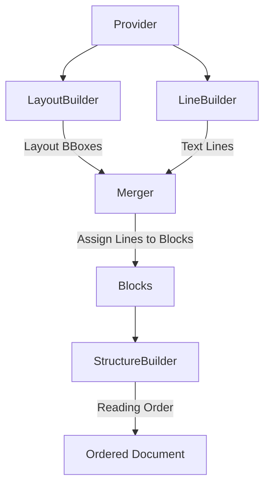

# Construction Phase: Builders

The **Construction** phase turns raw provider data into a structured `Document` object model. This is coordinated by the `DocumentBuilder`.

## The `DocumentBuilder`

The `DocumentBuilder` (`marker/builders/document.py`) orchestrates several specialized builders to populate the document.

### 1. Layout Detection (`LayoutBuilder`)
*   **Tool**: Uses [Surya](https://github.com/VikParuchuri/surya) (a deep learning model).
*   **Input**: Rasterized images of document pages.
*   **Output**: A list of Bounding Boxes with labels (e.g., `Text`, `Table`, `Image`, `SectionHeader`).
*   **Action**: Creates empty `Block` objects with `polygon` coordinates on the `Page`.

### 2. Text Extraction (`LineBuilder`)
*   **Tool**: `pdftext` (fast C++ extractor) or heuristic scraping.
*   **Input**: PDF file.
*   **Output**: Individual text lines with bounding boxes.
*   **Action**: These lines are "assigned" to the Layout Blocks. If a Layout Block (e.g., a paragraph box) overlaps with text lines, those lines become children of that block.
    *   *Fallback*: If lines exist where no Layout Block was detected, new blocks are created heuristically.

### 3. OCR (`OcrBuilder`)
*   **Trigger**: If text extraction yields garbage (high character replacement) or if the `force_ocr` flag is on.
*   **Tool**: [Surya](https://github.com/VikParuchuri/surya) (OCR mode).
*   **Action**: Overwrites the text content of blocks with OCR results.

### 4. Ordering (`StructureBuilder`)
*   **Problem**: Layout detection gives bags of boxes. PDF text is often stored in arbitrary order.
*   **Action**: Determines the logical reading order of blocks (e.g., top-left to bottom-right, handling columns).
*   **Result**: Populates the `structure` attribute of the `Page`, which is an ordered list of `BlockId`s.

## Data Structure: The `Document` Graph

At the end of this phase, we have a `Document` object:

*   **Document**
    *   `metadata`: Global info.
    *   **Pages** (List)
        *   **Page**
            *   `children`: All Block objects (unordered map or list).
            *   `structure`: List[BlockId] (The ordered reading list).
            *   **Blocks** (e.g., Text, Table)
                *   `polygon`: Bounding box.
                *   `html/text`: Content.
                *   `children`: (Recursive) For example, a Table might have TableRows.

