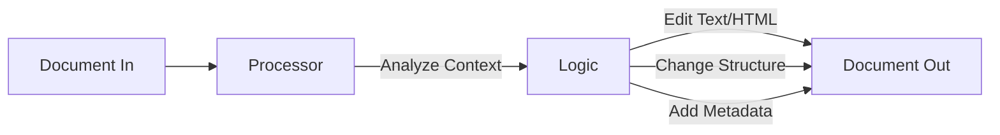

# Processing Phase: The Pipeline

Once the `Document` is built, it passes through a sequence of **Processors**. A Processor is a function or class that takes the `Document` and modifies it in place.

## Why Processors?

Raw extraction is rarely perfect. Processors handle:
*   **Cleanup**: Removing artifacts, headers, footers (`PageHeaderProcessor`, `IgnoreTextProcessor`).
*   **Normalization**: Merging lines that were split by wrapping (`LineMergeProcessor`).
*   **Semantics**: Identifying list hierarchies (`ListProcessor`), table structures (`TableProcessor`).
*   **Enrichment**: Using LLMs to improve content or add summaries (`LLM...` processors).

## Key Processors

### Heuristic Processors (Fast)
1.  **`BlockRelabelProcessor`**: Corrects mislabeled blocks based on content (e.g., a "Title" that looks like body text).
2.  **`LineMergeProcessor`**: Joins lines of text into full paragraphs.
3.  **`TableProcessor`**: Formats the content inside Table blocks.

### LLM Processors (Intelligent)
These are optional and enabled with `--use_llm`. They call external APIs (Gemini, etc.).

1.  **`LLMTableProcessor`**: Fixes bad OCR in tables.
2.  **`LLMSummaryProcessor`**: Generates high-level summaries block groups..
    *   *Note*: Targets Groups (like `ListGroup`, `TableGroup`) to provide a single summary for the whole section.
3.  **`LLMSectionHeaderProcessor`**: Standardizes non-standard headers.

## Data Flow within a Processor

Every processor sees the **entire** document, allowing it to make decisions based on context (e.g., "is this the first page?", "is the previous block a header?").
