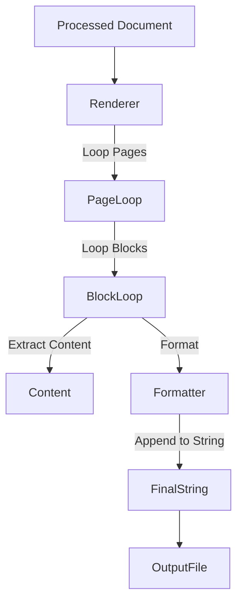

# Rendering Phase: Output

The final phase is **Rendering**, where the internal `Document` object is serialized into a format the user can use (Markdown, JSON, HTML).

## The `Renderer` Interface

Located in `marker/renderers`, renderers define how to traverse the document tree and stringify it.

## Markdown Renderer (`MarkdownRenderer`)

The most common output.
1.  **Traversal**: Iterates through the `structure` (ordered blocks) of each `Page`.
2.  **Formatting**:
    *   **Text**: Placed as is.
    *   **Headers**: Prefixed with `#`, `##` based on hierarchy.
    *   **Tables**: Converted to Markdown table syntax.
    *   **Images**: Saved to disk; a `` link is inserted.
    *   **Code**: Fenced with backticks.

## JSON Renderer (`JsonRenderer`)

Outputs the raw internal tree. Useful for debugging or downstream applications that need coordinates.
1.  **Recursion**: Dumps the `Document` -> `Page` -> `Block` hierarchy.
2.  **Fields**: Includes text, HTML, bounding box (`polygon`), and metadata.

## HTML Renderer (`HtmlRenderer`)

Similar to Markdown but wraps blocks in HTML tags (e.g., `
`, `
`) and allows for more styling hook.

## Data Flow

